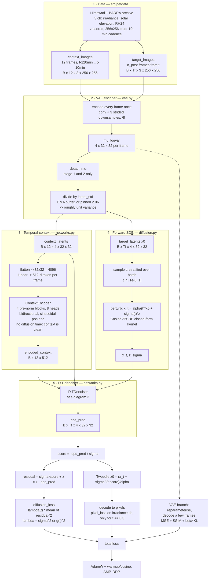
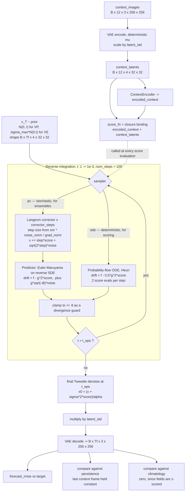
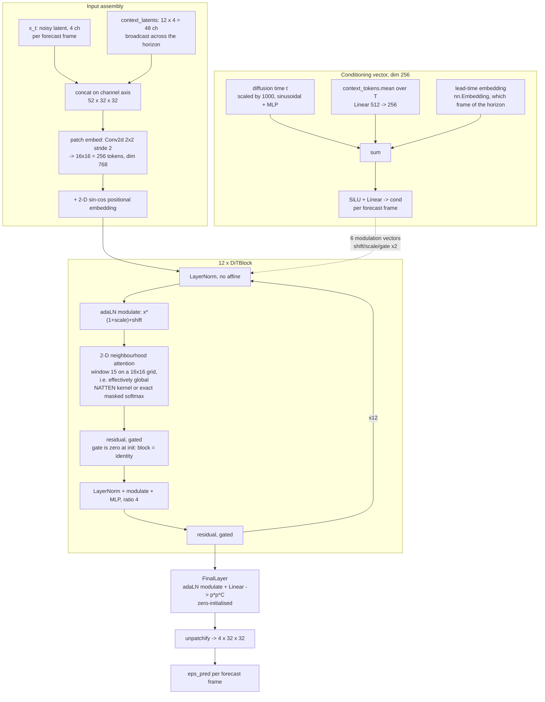
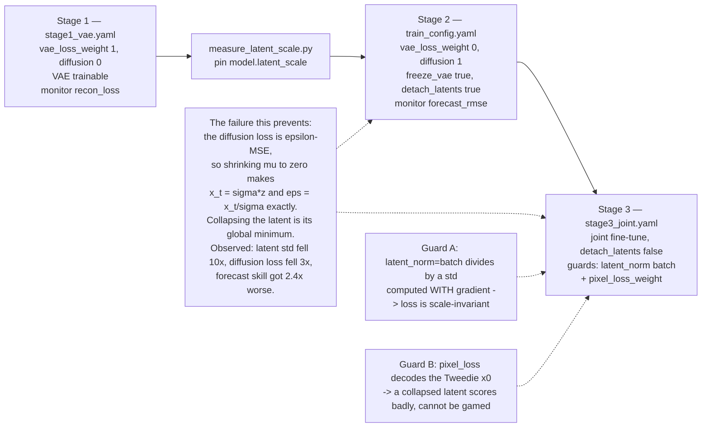

# CPDiT architecture

A conceptual walkthrough of the latent diffusion transformer used for solar
irradiance nowcasting, with Mermaid diagrams of the training step, the sampling
loop, the denoiser internals, and the training stages. Numbers throughout are
the defaults in `configs/train_config.yaml`.

The diagrams render on GitHub, or paste a block into https://mermaid.live.

Where the pieces live:
- `src/models/vae.py` — pixel <-> latent compression
- `src/models/networks.py` — `ContextEncoder` + `DiTDenoiser` (the two learned nets)
- `src/models/diffusion.py` — SDEs and reverse-time samplers (no parameters)
- `src/models/latent_diffusion.py` — assembly, score function, loss, sampling
- `src/training/train.py`, `src/training/config.py`, `configs/*.yaml` — staging
- `src/petdata/__init__.py` — pyearthtools data pipeline

## The one-paragraph version

CPDiT is a **score-based latent diffusion model** conditioned on the recent past.
A VAE squashes each 256x256x3 satellite frame to a 4x32x32 latent map. The 12
context frames are encoded temporally by a small transformer; the forecast
frames are corrupted by a continuous-time SDE and a DiT is trained to predict
the noise. At inference you start from pure Gaussian noise in latent space,
integrate the reverse SDE (or the probability-flow ODE) down to t=0 while
calling the DiT at each step, and decode the result to pixels.

Three ideas carry most of the weight:

1. **Latent, not pixel, diffusion.** 256x256x3 -> 4x32x32 is a ~48x reduction in
   what the diffusion model must model (`vae.py`).
2. **The context enters twice, on purpose.** *Spatially* — the 12 context latent
   maps are concatenated channel-wise to the noisy latent before patch embedding,
   so the denoiser knows *where* the clouds are. *Globally* — a pooled summary
   from the temporal transformer, plus diffusion time and lead time, drives
   adaLN-Zero modulation in every block (`networks.py:530-537`).
3. **Score parameterisation.** The net emits `eps`, the score is `-eps/sigma`.
   Under the default `sigma2` weighting the loss is numerically identical to
   epsilon-MSE, but everything built on top — continuous time, choice of SDE,
   PC/ODE samplers, likelihood weighting — is genuinely score-based.

## Diagram 1 — training step (end to end)

## Diagram 2 — inference / sampling

## Diagram 3 — inside the DiT denoiser

## Diagram 4 — why training is staged

## Shapes, at the configured defaults

| Stage | Tensor | Shape |
|---|---|---|
| input | context / target frames | `B x 12 x 3 x 256 x 256` / `B x 1 x 3 x 256 x 256` |
| VAE latent | per frame | `4 x 32 x 32` |
| context token | per frame | `512` |
| DiT input | per forecast frame | `52 x 32 x 32` |
| DiT tokens | patch 2, grid 16x16 | `256 x 768` |
| cond vector | per forecast frame | `256` |
| output | eps_pred | `B x Tf x 4 x 32 x 32` |

## Things worth knowing that the diagrams flatten

- **`t` is continuous, not a step index.** No discrete timestep ladder anywhere;
  `sample_times` draws stratified across the batch so the whole time axis is
  visited each step.
- **The ContextEncoder is not conditioned on diffusion time** — it only ever sees
  clean latents, so there is no noise level to tell it about.
- **`window_size: 15` on a 16x16 token grid means attention is global.** The
  neighbourhood machinery only bites if `patch_size` drops or `image_size` grows.
- **The lead-time embedding is load-bearing** for multi-step forecasts: without
  it every frame of the horizon would be an identical draw from the same
  conditional distribution. With `n_post: 1` it is currently near-inert.
- **Validation is deterministic by construction** — fixed times via `_eval_times`
  and a seeded noise draw — so early stopping is not watching a random variable.
- **`forecast_metrics` runs the real reverse process** on a small fixed subset,
  and always reports persistence and climatology alongside, because an RMSE with
  no baseline says nothing about nowcasting skill.

## Further reading

- Song et al. 2021 — https://arxiv.org/abs/2011.13456 — score-based SDEs
- Rombach et al. 2022 — https://arxiv.org/abs/2112.10752 — latent diffusion
- Peebles & Xie 2023 — https://arxiv.org/abs/2212.09748 — DiT and adaLN-Zero
- Hassani et al. 2023 — https://arxiv.org/abs/2204.07143 — neighbourhood attention
